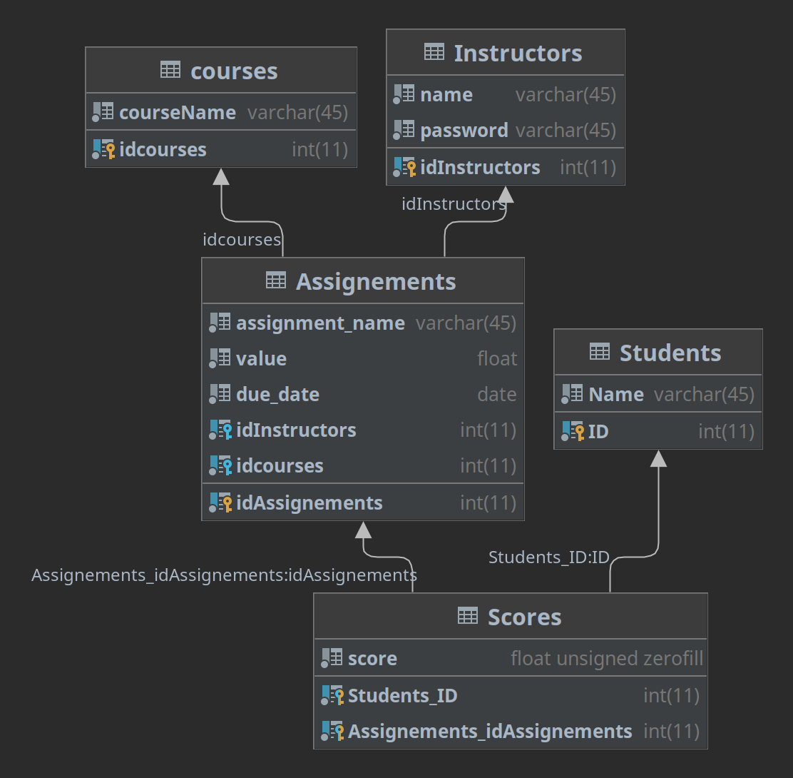

# Grade Book Project

Once I know what this is I'll put it here

## Database

- Diagram:

- Scheme can be generate by executing [gradeBookSchema.sql](gradeBookSchema.sql)
## User Interface

ASCII sketches of user interfaces: [Here](lofi_menues.md)

## Progress

[Project Tracker](https://www.pivotaltracker.com/n/projects/2632608)
